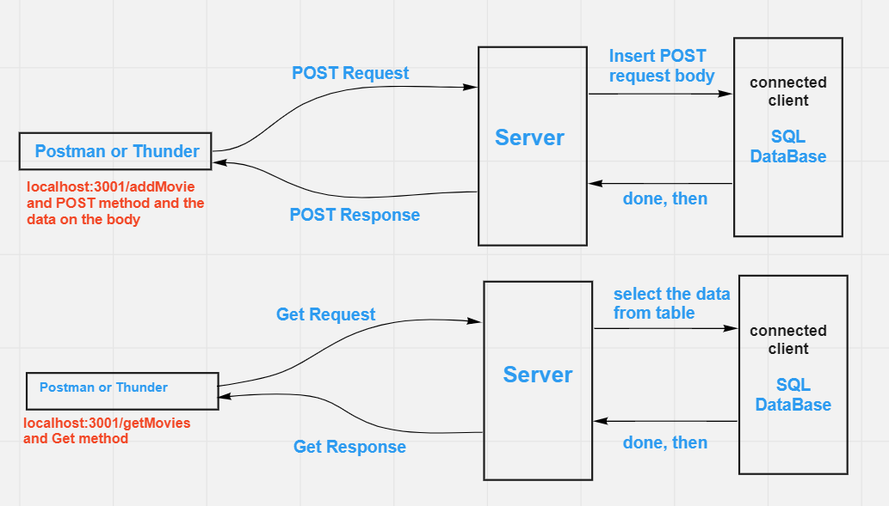

# Movies-Library

# movie app - Version 1

**Author Name**: Ala' Alwazani

## WRRC

## Overview

## Getting Started
<!-- What are the steps that a user must take in order to build this app on their own machine and get it running? -->
1. on terminal write npm start
2. go to the Postman or Thunder and choose "POST" then write "localhost:3001/addMovie" and add in the body in JSON_format the data you want to create and add at last 
,"comments": "your personal comments"

or localhost:3001/getMovies
go to the Postman or Thunder and choose "get" then write "localhost:3001/getMovies" it will get you the Movies you added.

## Project Features
<!-- What are the features included in you app -->
Function handelAddMovie(write on the SQL Database)
The user send data with POST method , the server read the body of the request,and insert the information which I choose into table favMovies(wich connect to the database(moviesadded)) then server send response.

Function handleGetMovies(read from the SQL Database)
return the whole rows which are in the table(favMovies) as response. 