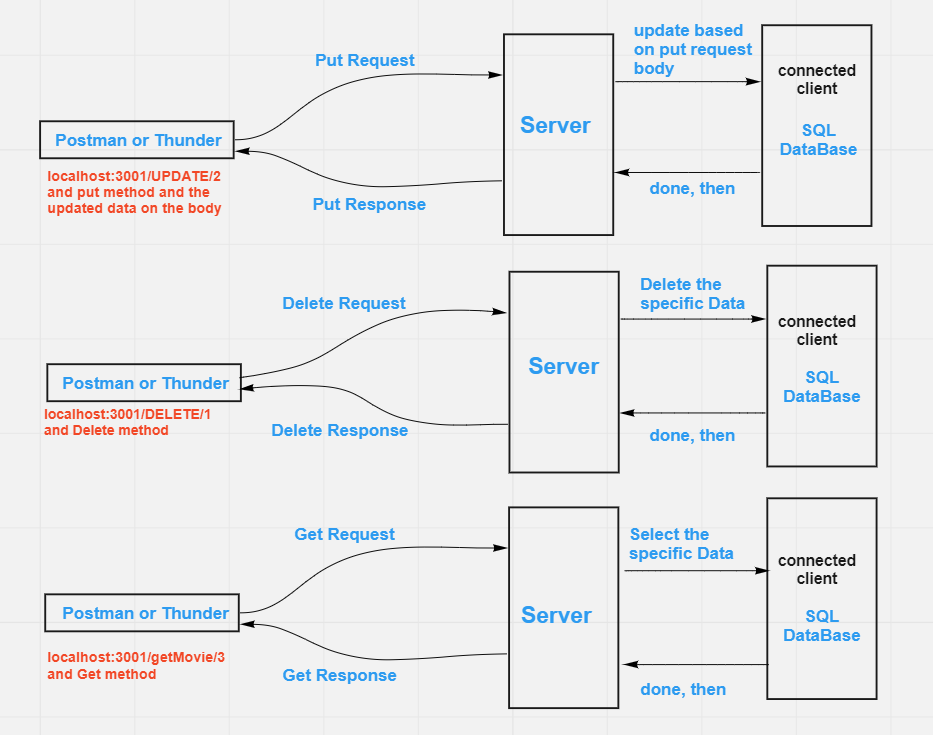

# Movies-Library

# movie app - Version 1

**Author Name**: Ala' Alwazani

## WRRC

## Overview

## Getting Started
<!-- What are the steps that a user must take in order to build this app on their own machine and get it running? -->
1. on terminal write nodemon
2. go to the Postman or Thunder and choose "put" method then write "localhost:3001/UPDATE/theIdForTheObjectYouWantUpdate" and add in the body in JSON_format the data you want to update.

or localhost:3001/DELETE/theIdForTheObjectYouWantDelete
go to the Postman or Thunder and choose "delete" method it will return to you an empty object.

or localhost:3001/getMovie/theIdForTheObjectYouWantGet
go to the Postman or Thunder and choose "get" method it will return to you the object you request to get.

## Project Features
<!-- What are the features included in you app -->
Function handelUpdateMovie(update on the SQL Database)
The user send updated data with PUT method and the id for this data , the server read the body of the request and the id for that data,and update the data in table favMovies(wich connect to the database(moviesadded)) then server send response with this updated data.

Function handleDeleteMovie(Delete specific object from the SQL Database)
The user send the id for the data he wants to delete, the server read this id and delete it from the table.

Function handleGetSpecificMovie(read specific object from the SQL Database)
The user send the id for the data he wants to get, the server read this id and response with the data which the user request .