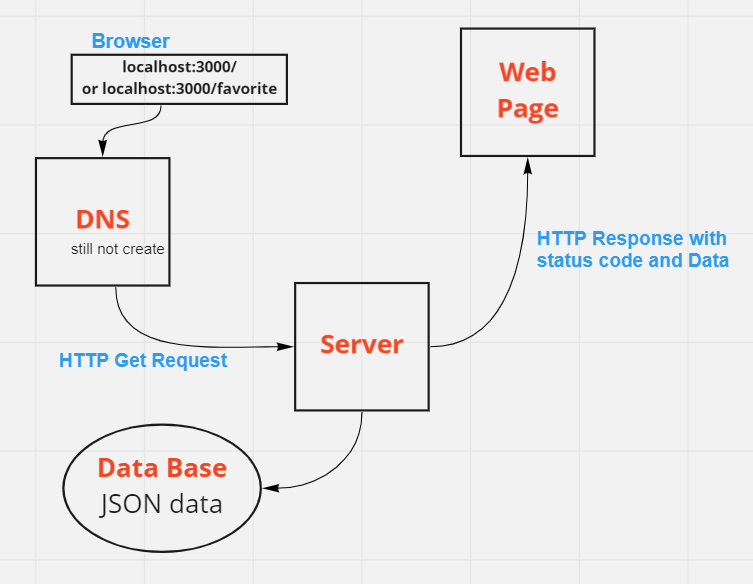

# Movies-Library

# movie app - Version 1

**Author Name**: Ala' Alwazani

## WRRC

## Overview

## Getting Started
<!-- What are the steps that a user must take in order to build this app on their own machine and get it running? -->
1. on terminal write npm start
2. go to the URL and write localhost:3500/ or localhost:3500/favorite

## Project Features
<!-- What are the features included in you app -->
the Home  use the provided JSON data,and make input data follow the same format.
